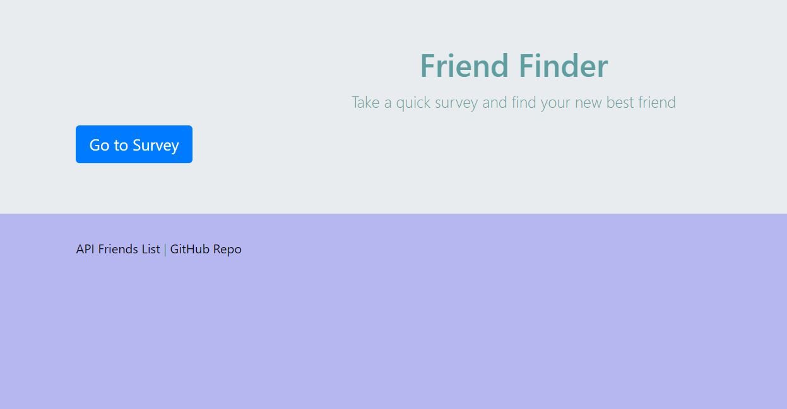
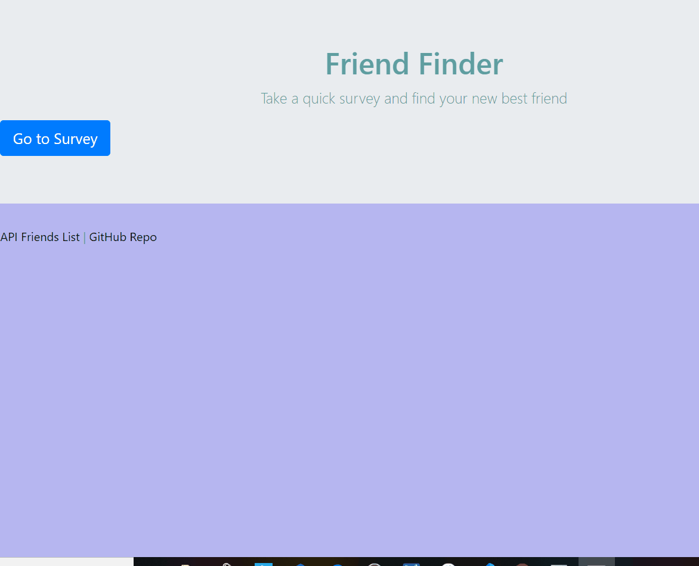

# friend-finder

This is a simple compatibility-based "FriendFinder" application. 

This full-stack site will take in results from user's survey and compare their answers with those from others users. The app will then display the name and picture of the user with the best overall match as shown below:

## Technologies used
. NOde.js
. Express NPM Package
. Path NPM package

## Heroku link
(https://shrouded-stream-45016.herokuapp.com/)